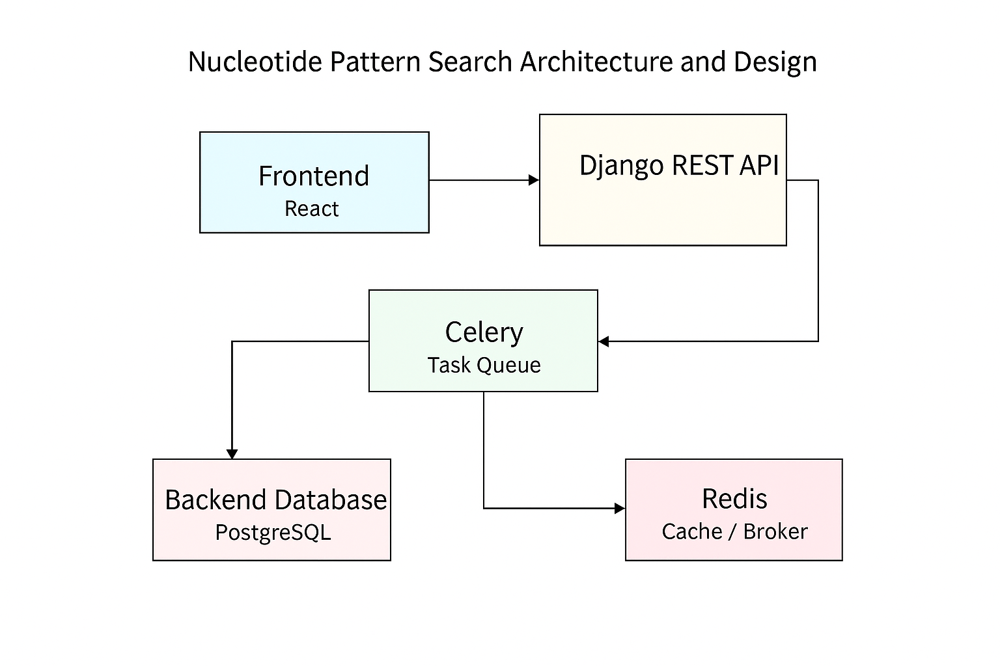

# 🧬 Nucleotide Pattern Search Platform

This project is a web-based tool to fetch large-scale nucleotide sequences from NCBI, store them efficiently in chunks, and search for specific patterns using distributed processing. It leverages **React**, **Django REST**, **Celery**, **Redis**, **Virtualenv** , **Memcache** and **PostgreSQL**.

---

## 🔄 Frontend ⇄ Backend Communication

### 📤 Step 1: Submitting a Search Task

- **Frontend (React)** sends a `POST` request to `/api/post/`:
  ```json
  {
    "id": "30271926",
    "pattern": "GGCAT"
  }
  ```
- **Backend (Django)** receives this request, starts an asynchronous job using `Celery chord`, and returns a `task_id` immediately:
  ```json
  {
    "task_id": "abc1234...",
    "message": "Chained tasks started. You can poll the result using the task_id."
  }
  ```

### 🤖 Why use POST?
- Because the action initiates **a process with side effects** — it triggers backend logic, stores data, and starts asynchronous jobs, which makes `POST` semantically correct over `GET`.

---

### 🔁 Step 2: Polling for Results

- The **React app** sets a timer and repeatedly makes `GET` requests to `/api/get/<task_id>/` every second:
  ```http
  GET /api/get/abc1234/
  ```
- The **Django backend** checks:
  - If the task is completed, it returns the result.
  - If not ready, it keeps returning `PENDING`.

### 🔍 Why use polling instead of WebSocket?
- Simplicity: Polling is easier to implement and doesn't require persistent WebSocket connections.
- Reliability: Works even when real-time infrastructure isn't available.
- But it has drawbacks:
  - Delay in result delivery.
  - Inefficient for long-running tasks.

### 📥 Response from Backend when Ready:
```json
{
  "task_id": "abc1234",
  "status": "SUCCESS",
  "is_ready": true,
  "result": {
    "GGCAT": [543, 672, 1572, ...]
  }
}
```

The result is shown in the frontend as a list of matching positions, grouped by pattern.

## 📐 Architecture Overview

```
[React Frontend] ──▶ [Django REST API] ──▶ [Celery Task Queue]
                                       │              │
                                       ▼              ▼
                             [PostgreSQL DB]     [Redis (Cache/Broker)]
```

- **Frontend**: React form UI that submits search tasks and polls for results.
- **Backend**: Django REST endpoints trigger Celery chord tasks.
- **Async Tasks**: Celery breaks the job into chunked regex searches.
- **Storage**: PostgreSQL stores sequence data in 5MB chunks.
- **Cache**: Redis caches task results and acts as the Celery broker.

---

## 🚀 Features

- ✅ Pattern matching in massive nucleotide sequences.
- ✅ Efficient database chunking for scalability.
- ✅ Async distributed task processing with Celery chords.
- ✅ Caching to avoid redundant computations.
- ✅ Real-time polling with timeout fallback.
- ✅ Fully decoupled frontend-backend architecture.

---

## 🏗️ Design & Decisions

### 1. **Chunked Storage (PostgreSQL)**

Each nucleotide sequence is divided into **5MB chunks** and stored as rows in the `NucleotideChunk` model in PostgreSQL.

#### ✅ Benefits:
- **Efficient Memory Use**: By streaming and writing data in chunks, we avoid loading large files entirely into memory.
- **Parallel Processing**: Chunks can be distributed across Celery tasks for regex searches.
- **Simple Querying**: SQL queries can retrieve and process parts of sequences without file system complexity.

#### 🆚 Alternatives and Comparison

| Method                        | Pros                                              | Cons                                                  |
|------------------------------|---------------------------------------------------|-------------------------------------------------------|
| **PostgreSQL Chunked (Current)** | Easy to query, transactional, supports parallelism | Potentially slower I/O vs filesystem for large reads |
| **Save to Disk (e.g., `.fasta` file)** | Very fast read/write for large files             | Harder to manage metadata and parallel search        |
| **PostgreSQL BYTEA (Binary)**       | Compact binary storage inside DB                 | Harder to index or split, memory-intensive on decode |
| **PostgreSQL Large Objects (LOB)** | Optimized for very large binary data             | More complex API, poor random access per chunk       |
| **Cloud Blob Storage (e.g., S3)**   | Scalable and cost-efficient for huge data        | Requires external infrastructure and authentication  |

#### 🔍 Why Chunked in PostgreSQL?

- ✅ Integrated with Django ORM — no additional tooling needed.
- ✅ Indexable by `sequence_id` and `chunk_index`.
- ✅ Easily extendable — you can add metadata, tags, versioning.
- ❗ Consider switching to LOB or disk-based storage if dealing with **>1GB genomic data** or very high-throughput environments.


### 2. **Celery + Chord Pattern**
- Each chunk is searched concurrently via `search_chunk_task`.
- Results are combined and cached with `combine_and_cache`.

### 3. **Caching Layer**
- Results are cached in Redis for 1 hour (`match:{nucleotide_id}:{pattern}`) to avoid recomputation.

### 4. **API Design**
- `POST /api/post/` triggers the task.
- `GET /api/get/<task_id>/` polls the result.

---

## 📁 Project Structure

```
├── App.js              # React frontend
├── views.py            # Django API views
├── tasks.py            # Celery task definitions
├── models.py           # DB models for chunk storage
├── get_sequence.py     # Sequence fetch and chunk logic
├── apps.py             # Django app config
```

---

## ⚙️ Setup & Usage

### Prerequisites
- Python 3.11+
- Redis
- PostgreSQL
- Node.js + npm (for React)

### 1. Backend Setup

```bash
# Install dependencies
pip install -r requirements.txt

# Start Redis
redis-server

# Run Django server
python manage.py migrate
python manage.py runserver

# Start Celery
celery -A myproject worker --loglevel=info
```

### 2. Frontend Setup

```bash
cd frontend
npm install
npm start
```

---

## 📊 Example

```bash
POST /api/post/
{
  "id": "30271926",
  "pattern": "GGCAT"
}

GET /api/get/<task_id>/
# Response:
{
  "status": "SUCCESS",
  "result": {
    "GGCAT": [543, 672, 1572, ...]
  }
}
```

---

## ⚠️ Known Limitations

- ❗ Fixed polling timeout (30s).
- ❗ No retry logic on failed tasks.
- ❗ No rate-limiting for external API (NCBI) calls.
- ❗ Minimal error handling in network layer.

---

## 🛠️ Future Enhancements

| Feature                        | Description                                          |
|-------------------------------|------------------------------------------------------|
| ✅ WebSocket support           | Real-time result delivery instead of polling        |
| ✅ Progress tracking           | Live updates on chunk processing progress           |
| ✅ Retry mechanism             | Retry failed tasks using Celery's built-in options  |
| ✅ Sequence metadata storage   | Store headers and source info                       |
| ✅ Background cron job         | Auto-clean expired Redis cache or old DB entries    |


---

## 🧪 Task 2: Command-Line Utility for Large Sequence Search

In this part, we provide a command-line tool to run a pattern search on a large nucleotide sequence (e.g., 224589800, ~238MB) using Django management commands.

### 🔧 Script: `run_sequence_search.py`

- Located in your Django app as a custom management command.
- Invoked with `python manage.py run_sequence_search`.

### 📤 How It Works

1. The script accepts a `nucleotide_id` and a `pattern` as CLI arguments.
2. It calls `run_job()` to launch a Celery chord job across sequence chunks.
3. It waits (blocking) for results using `AsyncResult().get()`.
4. Results are saved to a timestamped `.json` file or a user-specified output path.

### 🖥️ Example Command

```bash
python manage.py run_sequence_search 224589800 "GGCAT"
```

or with a custom output file:

```bash
python manage.py run_sequence_search 224589800 "GGCAT" --output results.json
```

### 📁 Sample Output (JSON)

```json
{
  "GGCAT": [543, 672, 1572, 2057, ...]
}
```

### 📌 Why a Command Line Tool?

- ✅ Ideal for **automated pipelines** and **batch jobs**.
- ✅ Can handle **very large sequences** without frontend limitations.
- ✅ Decouples UI concerns from processing logic.
- ✅ Easily scriptable and integrable with cron or SLURM.
